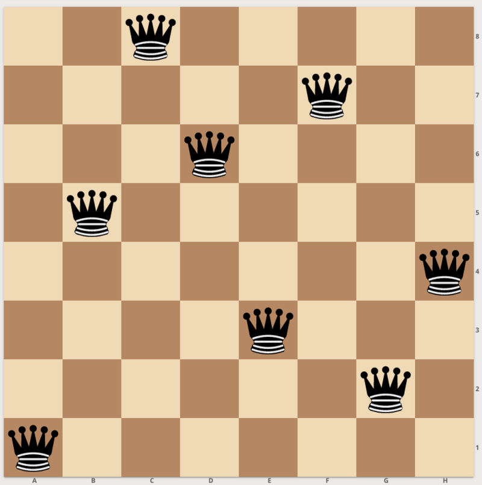

# ♛ N-queens

This program returns a solution for a given size of the well-kown n-queens problem. The implementation uses an iterated local search algorithm which is guided by a minimal conflicts heuristic.  
&nbsp;&nbsp;  
The program uses a one-dimensional list to represent a particular queen configuration on the chessboard. The list indices specify the row numbers of each queen position, and the actual values stored at those indices indicate the corresponding column numbers. Note that the used board indices start from zero and increase from the top left to the bottom right. For instance:

```
[1,3,0,2]
```
This list represents a 4x4 chessboard where the four queens are positioned at locations (0,1), (1,3), (2,0), and (3,2). Graphically this valid solution to the 4-queens problem is represented as follows:

```
.Q..
...Q
Q...
..Q.
```

## ♟ Usage

To run the program, make sure to provide the input size n as an argument. For example:

```
python3 nqueens.py 250
```

The above command will write a solution for the 250-queens problem to a .out file in the output folder (which will be created if it does not exist) of the current working directory. For sizes n < 200, a graphical representation of the chessboard is included. For larger problem sizes, the output only consists of a list of all the queen positions.  
The same program also allows for specifying one fixed board location, indicated by its coordinates. For example:  

```
python3 nqueens.py 10 [2,8]
```

This command will generate a solution for a problem with 10 queens, of which one is set to take the spot with row index 2 and column index 8.    
If no solution exists, the program will output an appropriate message.    


## ♟ References  

- Minton, S., Johnston, M. D., Philips, A. B., & Laird, P. (1992). Minimizing conflicts: a heuristic repair method for constraint satisfaction and scheduling problems. Artificial intelligence, 58(1-3), 161-205.
- Russell, S., & Norvig, P. (2010). Artificial Intelligence: A Modern Approach.
- Sosic, R., & Gu, J. (1990). A polynomial time algorithm for the n-queens problem. ACM SIGART Bulletin, 1(3), 7-11.
- Sosic, R., & Gu, J. (1991). 3,000,000 queens in less than one minute. ACM SIGART Bulletin, 2(2), 22-24.
- Sosic, R., & Gu, J. (1994). Efficient local search with conflict minimization: A case study of the n-queens problem. IEEE Transactions on Knowledge and Data Engineering, 6(5), 661-668.


  
&nbsp;&nbsp;&nbsp;&nbsp;&nbsp;&nbsp;
&nbsp;&nbsp;&nbsp;&nbsp;&nbsp;&nbsp;
&nbsp;&nbsp;

<p align="center" width="85%">
  
</p>  
